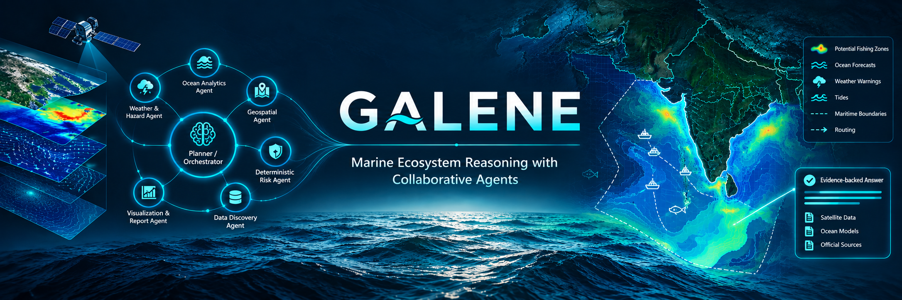
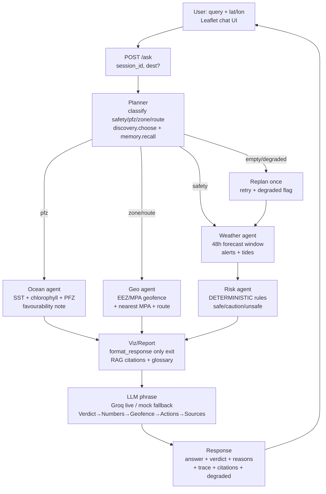

# Galene


### Marine Ecosystem Reasoning with Collaborative Agents

[](https://www.sih.gov.in/)
[](https://www.python.org/)
[](https://fastapi.tiangolo.com/)
[](https://leafletjs.com/)
[](https://groq.com/)
[](#how-it-works--pipeline-flowchart)

Smart India Hackathon 2026 — Agentic, conversational marine intelligence for
fishermen, researchers, and coastal authorities.

English-only Q&A with explainable, evidence-backed recommendations: safety
verdicts, PFZ outlook, geofence warnings, and routing — with maps, alerts,
and a full reasoning trace on every answer.

---

## The Problem

Marine information is fragmented across portals — satellite oceanography,
Potential Fishing Zone (PFZ) advisories, Ocean State Forecasts, IMD warnings,
and maritime boundary maps. A fisher asking *“Is it safe to go to sea tomorrow
morning?”* must separately checkPFZ bulletins, wave forecasts, cyclone warnings,
tide tables, and restricted-zone charts — then reconcile them by hand.

Galene unifies this into one conversational query with a deterministic verdict
and cited evidence.

---

## What We Built

An **agentic marine system** where a planner classifies intent, routes to
specialist agents via typed tools, applies deterministic risk rules, and returns
a RAG-grounded advisory. No per-query code — just `query + lat/lon → { answer,
verdict, reasons, trace, citations }`.

### Example Turn

```
INTELLIGENCE QUERY — safety / Kochi (15.0, 74.0)

Query: "Is it safe tomorrow morning?"
```

```json
{
  "answer": "[SAFE] Window 2026-09-29 04:00-11:00: max wind 13 km/h, max wave 1.0 m. ... Geofence: inside Indian EEZ, clear of protected areas. ... Sources: forecast_provenance, safety_thresholds.",
  "verdict": "safe",
  "reasons": ["Wind 13 km/h within limits.", "Waves 1.0 m within limits."],
  "citations": ["forecast_provenance", "safety_thresholds"],
  "trace": [
    {"agent": "planner", "tool": "classify:safety"},
    {"agent": "weather", "tool": "get_forecast"},
    {"agent": "weather", "tool": "get_alerts"},
    {"agent": "weather", "tool": "get_tides"},
    {"agent": "risk", "tool": null},
    {"agent": "geo", "tool": "check_geofence"},
    {"agent": "viz", "tool": "llm:groq"}
  ]
}
```

### Pipeline Flowchart



---

## Features

**Ask anything about the sea**
- Safety verdicts (`safe/caution/unsafe`) with reasons for any location and morning window
- PFZ outlook with SST, chlorophyll, and favourability assessment
- Tide, weather, and sea-condition briefings; cyclone and hazard alerts
- Geofence checks — EEZ status, MPA warnings, nearest protected area with distance
- Route planning with MPA detours plus a departure-window verdict
- Side-by-side site comparison (“Compare Kochi vs Chennai tomorrow?”)
- Multi-turn memory — follow-ups remember the conversation
- Every answer carries its reasoning trace, data citations, and sources

**See it on the map**
- Satellite ocean basemap with city, boundary, port, and sea-name overlays
- Real EEZ and marine-protected-area polygons; PFZ zone markers with depth popups
- Live IMD alert polygons colored by severity
- Sea-surface-temperature productivity grid and Sentinel chlorophyll overlay
- 48-hour tide/wave/wind chart with hover details; click anywhere to relocate
- Sentinel-2 true-colour overlay for the current view

**Built for trust and demo**
- Deterministic, auditable risk rules — the LLM phrases, never decides
- RAG-grounded wording with a terminology guardrail; structured Verdict → Numbers → Geofence → Actions → Sources answers
- Key measures, percentages, coordinates, and warnings highlighted inline
- Proactive watchlist alerts CLI covering key fishing centres
- Dark marine theme; English-only evaluation set of product queries; one-command Docker and Render deploys

---

## Product Constraints

| Constraint | Description | Why It Matters |
|---|---|---|
| **Deterministic risk** | `safe/caution/unsafe` from rules + geometry (`backend/app/agents/risk.py`), never ML/LLM | Verdicts are auditable and reproducible |
| **English-only** | Multilingual support is out of scope; no translation deps | Keeps the demo tight; all user text flows through one `format_response()` for a future language layer |
| **Swappable LLM** | Provider via env (`ORCA_LLM_PROVIDER`), `mock` default, Groq live (`backend/app/llm.py`) | Offline demo + cloud LLM with zero code change |
| **Verified sources only** | Every endpoint probed live before use; see `docs/data_sources.md` | No fabricated URLs, schemas, or data |
| **Offline fallback** | Every fetcher: live → file cache → checked-in fixture | Demo survives zero connectivity |
| **Graded trace** | Every answer carries agents, tools, data provenance, timestamps | Evaluated as first-class output, not a debug log |

---

## Agent Roster

| Agent | Module | Tools Used | Status |
|---|---|---|---|
| **Planner/Orchestrator** | `backend/app/agents/planner.py` | classify, discovery, replan | REAL |
| **Weather/Hazard** | `backend/app/agents/weather.py` | `get_forecast`, `get_alerts`, `get_tides` | REAL |
| **Ocean Analytics** | `backend/app/agents/ocean.py` | `get_sst`, `get_chlorophyll`, `get_pfz` | REAL |
| **Geospatial** | `backend/app/agents/geo.py` | `check_geofence`, `plan_route` | REAL |
| **Risk** | `backend/app/agents/risk.py` | rules only (no tools, no LLM) | REAL |
| **Data Discovery** | `backend/app/agents/discovery.py` | dataset chooser per intent | REAL |
| **Viz/Report** | `backend/app/agents/report.py` | `format_response()` + RAG citations | REAL |

## Tool Layer (8 Typed Tools)

| Tool | Module | Live Source |
|---|---|---|
| `get_forecast` | `backend/app/tools/weather_tools.py` | Open-Meteo forecast API (verified, keyless) |
| `get_tides` | `backend/app/tools/weather_tools.py` | Fixture + Open-Meteo sea-level proxy |
| `get_alerts` | `backend/app/tools/weather_tools.py` | IMD fixture (API needs key) + live wind/wave |
| `get_sst` | `backend/app/tools/ocean_tools.py` | Open-Meteo marine SST (live) |
| `get_chlorophyll` | `backend/app/tools/ocean_tools.py` | Copernicus fixture (account wired, products TBD) |
| `get_pfz` | `backend/app/tools/ocean_tools.py` | INCOIS fixture (pages verified, no JSON API) |
| `check_geofence` | `backend/app/tools/geo_tools.py` | Real EEZ (MarineRegions) + 6 WDPA MPAs, simplified |
| `plan_route` | `backend/app/tools/geo_tools.py` | Haversine + MPA-detour baseline |

## Data Sources

| Source | Access | Status |
|---|---|---|
| Open-Meteo weather + marine | No key, JSON, verified HTTP 200 | LIVE |
| CDSE/Sentinel Hub OAuth | Client credentials verified (Bearer, 1800s) | TOKEN WIRED |
| MarineRegions EEZ v12 (MRGID 8480, CC-BY) | WFS pull, simplified 0.02° → 75 KB | SHIPPED |
| WDPA India marine MPAs (6 sites) | Public ArcGIS REST | SHIPPED |
| IMD warnings | 401 without key | FIXTURE (key TODO) |
| INCOIS PFZ / Ocean State Forecast | HTML pages, no JSON API found | FIXTURE |
| Copernicus Marine products | Toolbox needs username/password (≠ CDSE creds) | FIXTURE |
| GEBCO 2026 grid | GBs — never fetched at runtime | FIXTURE |
| India tides | No open JSON API (Survey of India = RAR/ZIP) | FIXTURE + sea-level proxy |

Full audit: `docs/data_sources.md`.

---

## Risk Rules

Provisional thresholds (`backend/app/agents/risk.py`, pending domain review):

```
wind > 61 km/h  → unsafe      wind > 40 km/h  → caution
wave > 4.0 m    → unsafe      wave > 2.5 m    → caution
any active IMD warning (≠ "No warning") → minimum caution
```

RAG grounds **wording only** — never the verdict.

---

## Tech Stack

| Layer | Technologies | Notes |
|---|---|---|
| **Backend** | Python 3.11+, **FastAPI**, **Uvicorn**, **Pydantic v2**, `pydantic-settings`, `httpx` | `backend/app/main.py` — `/ask`, `/health`, `/geo/*`, serves `frontend/` same-origin |
| **LLM** | **Groq** `openai/gpt-oss-120b` (OpenAI-compatible), `mock` fallback | `backend/app/llm.py` — temperature 0.2, mock-fallback on error |
| **Agents/Tools** | Pure Python, hand-rolled ray-cast geofence, haversine routing | No shapely/geopandas — zero geo deps |
| **RAG** | Stdlib TF-IDF cosine over `backend/app/rag/corpus/*.md` | Terminology guardrail + thresholds + provenance passages, cited per answer |
| **Memory** | In-process session store (50 sessions × 20 turns) | `backend/app/memory.py`, `session_id` in body / `localStorage` |
| **Frontend** | Static HTML + **Leaflet 1.9**, no build step | Chat, EEZ/MPA/PFZ layers, verdict badge, trace viewer |
| **Testing** | `pytest` (35 tests incl. English-only eval set) | `tests/test_eval.py` covers all 8 product-goal queries |

---

## How It Works

Intent routing (`planner.py`): keyword router first (deterministic, offline) —
`zone` outranks `pfz` so “restricted fishing zone” routes correctly; LLM confirms
only when no keywords match; unknown defaults to `safety`.

---

## Quickstart

```bash
python -m venv .venv && source .venv/bin/activate
pip install -e ".[dev]"
cp .env.example .env   # fill ORCA_LLM_API_KEY + Copernicus creds; never commit
uvicorn backend.app.main:app --port 8001   # serves API + UI same-origin
open http://127.0.0.1:8001
pytest -q              # 35 tests
```

Environment (`.env`, never commit — see `.gitignore`):

```
ORCA_LLM_PROVIDER=groq
ORCA_LLM_MODEL=openai/gpt-oss-120b
ORCA_LLM_BASE_URL=https://api.groq.com/openai/v1
ORCA_LLM_API_KEY=gsk_...
ORCA_COPERNICUS_CLIENT_ID=sh-...
ORCA_COPERNICUS_CLIENT_SECRET=...
```

Try: `Is it safe tomorrow morning?` → verdict + Geofence line + trace.
Click near Sundarbans (21.9, 88.9) → `Which zones to avoid?` → MPA warning.
Proactive sweep: `python3 scripts/check_alerts.py [--mock]`.

---

## API

| Method | Path | Description |
|---|---|---|
| `GET` | `/health` | `{status, llm_provider}` |
| `POST` | `/ask` | `{query, lat, lon, session_id?, dest_lat?, dest_lon?}` → `{answer, verdict, reasons, trace, citations, degraded}` |
| `GET` | `/geo/eez` | Real simplified Indian EEZ GeoJSON |
| `GET` | `/geo/mpas` | 6 real WDPA India marine sites GeoJSON |
| `GET` | `/geo/pfz?sector=KERALA` | PFZ zones (lat/lon/depth/direction) |
| `GET` | `/` | Leaflet UI (same-origin) |

---

## Project Structure

```
├── backend/app/
│   ├── main.py                 # FastAPI: /ask /health /geo/* + static UI mount
│   ├── config.py               # env-swappable LLM + Copernicus creds (mock defaults)
│   ├── llm.py                  # mock/Groq chat client (OpenAI-compatible)
│   ├── memory.py               # session store
│   ├── agents/                 # planner, weather, risk, ocean, geo, discovery, report
│   ├── tools/                  # 8 typed tools (schemas + ocean/weather/geo)
│   ├── data/                   # fetchers: openmeteo, imd, incois, copernicus, static_geo + cache
│   ├── rag/corpus/             # terminology guardrail, thresholds, provenance passages
│   └── api/                    # schemas (AskRequest/Response + trace) + geo router
├── frontend/                   # index.html + app.js + style.css (no build)
├── data/fixtures/              # offline JSON incl. real EEZ + MPA polygons
├── scripts/check_alerts.py     # watchlist proactive-alerts CLI
├── tests/                      # incl. test_eval.py English-only eval set (8 queries)
└── docs/                       # architecture, data_sources audit, demo script
```

---

## Research & Source References

- **INCOIS** — PFZ advisories & Ocean State Forecast: https://www.incois.gov.in/MarineFisheries/PfzAdvisory
- **IMD** — Mausam forecasts & warnings: https://mausam.imd.gov.in/ · API: https://api.imd.gov.in/
- **Copernicus Marine** — Data Store: https://data.marine.copernicus.eu/ · CDSE auth: https://identity.dataspace.copernicus.eu/
- **GEBCO** — 2026 gridded bathymetry: https://www.gebco.net/ · downloads: https://download.gebco.net/
- **MarineRegions** — EEZ v12 (CC-BY, doi:10.14284/632): https://geo.vliz.be/geoserver/MarineRegions/wfs
- **WDPA/Protected Planet** — marine protected areas: https://www.protectedplanet.net/ · REST: https://data-gis.unep-wcmc.org/
- **Open-Meteo** — weather + marine APIs (free non-commercial): https://open-meteo.com/en/docs
